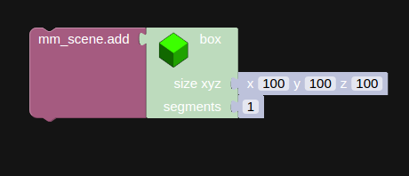
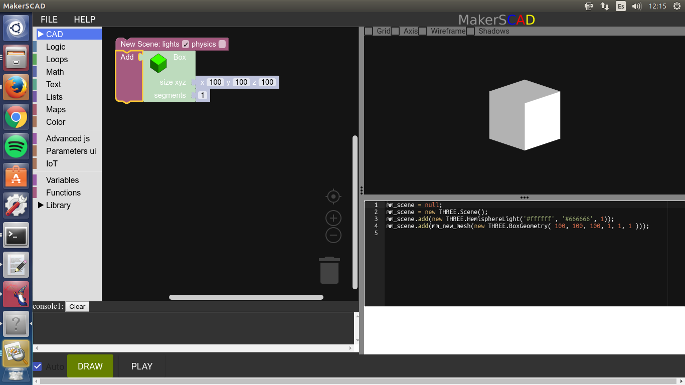
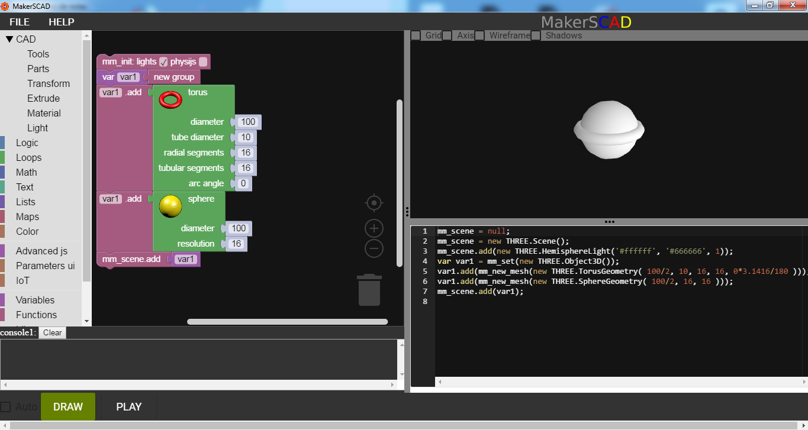
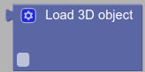
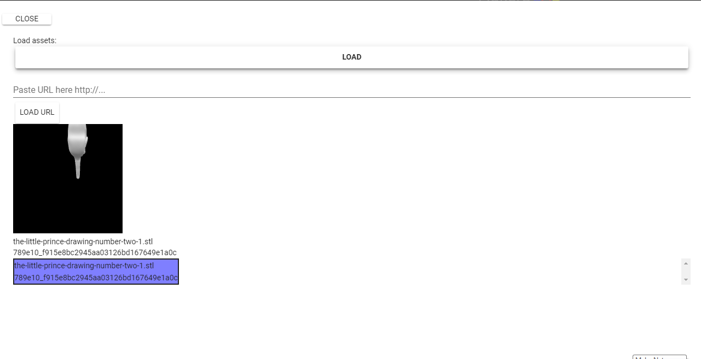
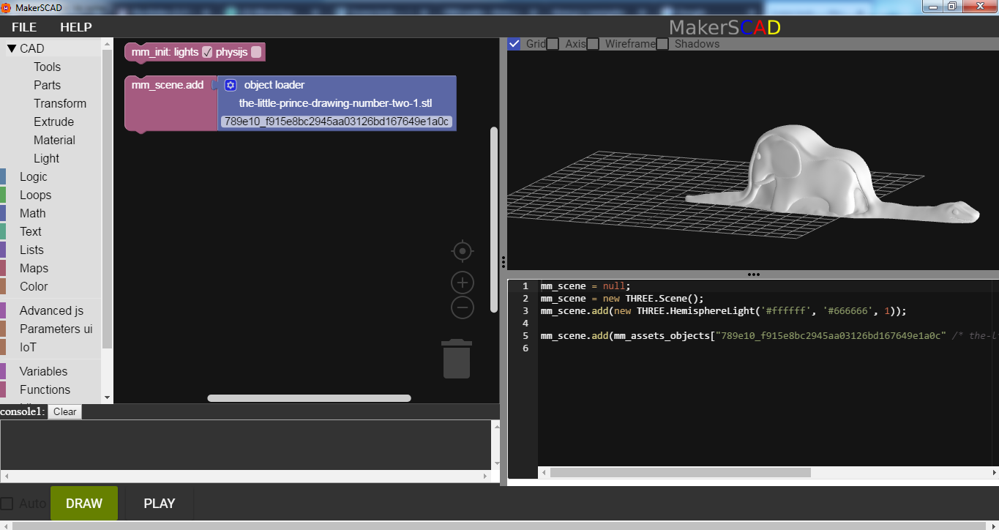
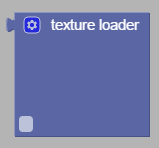
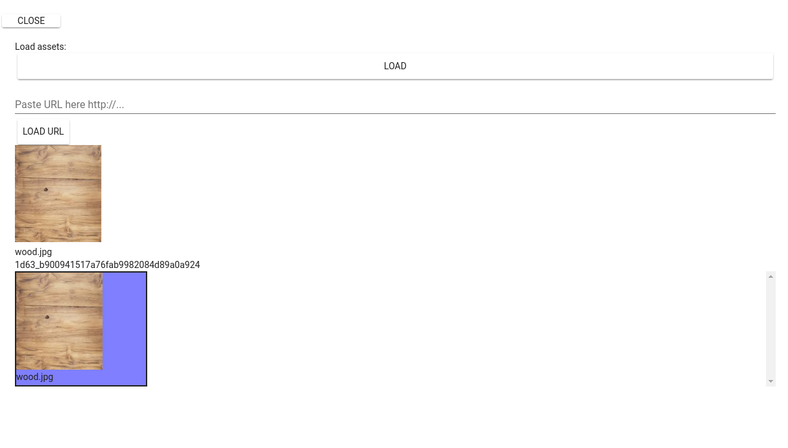
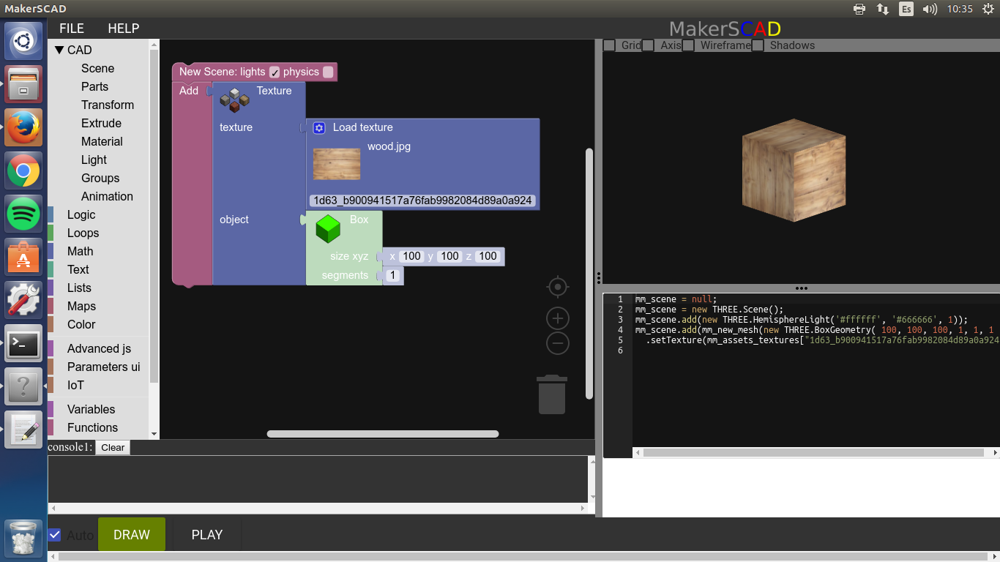

.. _scene:

***************
Scene tools
***************

.. _basicscene:

The basic scene
=============================

In order to start creating a 3D world we first need to set up a scene, in MakerSCAD we have preloaded a basic scene that comes with some basic lightning, material and shadow presets.
The basic scene can be found in the block library under the CAD/Tools section.

It looks like this:

      the basic scene block.

Go ahead and add a new basic scene to our workspace, right now it is an empty scene that we need to start adding objects to it in order to build our world.

.. note:: the new basic physic scene is similar to the basic scene but contains gravity, only use it when needed for game or animation logic.

.. _sceneadd:

Next  we have the scene.add block, this allows us to add an object to our scene objects include shapes, geometries, lights and more go ahead and take the scene.add block and plug it under the basic scene block.

      adding objects to our scene.

By default the add.scene block comes preloaded with a cube, go ahead and press the DRAW button! he have succesfully added our first object to our scene.

Now that we know how to add objects to our world lets look at some of them:

.. note:: the add scene block in photorealistic mode, needs lights to work.

.. _newGroup:

New group
=============================

In MakerSCAD , you can group objects by declaring group variables, to do this, you can use the "New group" block

First go to "Variables" and select the "var" block, then go to the "Tools" section and select a "New Goup" block, snap the new group to the variable

.. _objectAdd:

Object add
=============================
When you declare a variable as a group, you can use a special block called "object add".

in the previous section, we created a variable as a group, now go to tools and select the block that says "Var1.add"
Change the word "var1" for the name you used in your variable and snap a new part to it, for this example we will use a torus.

Now add another "var1.add" block, use the same variable name you declared before, snap a sphere to it.

finally add the variable to the scene with a "scene.add" block, remember thaat yu have to snap a "var" block to it

.. _objectLoader:

Object loader
=============================
Use an Object loader to load an obj or stl resource to the workspace, to add an object loader block go to CAD, then Tools, find the object loader block and click it.

Once you have an object loader in your workspace, click on the gear icon to open a file selection window, if you want to load a file from your PC click the "load" button" and browse your PC for an OBJ or STL file.
Also you can enter or paste an URL in the text box and then click the "load url" button to load from a web location.

you will see a preview of the file, then you can enter or click the "close" button, to close the window and go back to your workpsace.

Now you can add the loaded object to the scene as shown in the image

Texture loader
=============================
Use a texture loader to load image resources as textures, to add a texture loader block go to CAD, then Tools, find the texture loader block and click it.

Once you have an object loader in your workspace, click on the gear icon to open a file selection window, if you want to load a file from your PC click the "load" button" and browse your PC for an OBJ or STL file.
Also you can enter or paste an URL in the text box and then click the "load url" button to load from a web location.

you will see a preview of the file, then you can enter or click the "close" button, to close the window and go back to your workpsace

Then, to use the loaded texture you can go to CAD - Material, select a "setTexture" Block, and snap the texture loader instead of the default texture loader of the block, the result shoud look as follows:

