.. _shapes:

***************
Shapes
***************

.. _box:

The Box
=============================

The box geometry is found under the CAD/parts library
Go on and grab the cube block and plug it to the scene.add block.

this is the ScratchyCAD default box that measures 100x100x100 units.

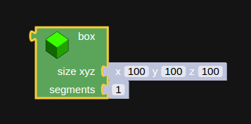

      ScratchyCAD's default box

The first parameter in the cube is asking for a size XYZ, for every parameter in ScratchyCAD
that asks for XYZ we need to plug in a special block that contains a list of three numbers
one for lenght (x), one for width (y) and one for height (z).
For now grab lets use the preset and change the values on the  x,y,z inputs. Activate the Auto checkbox on the left right corner and see how each value affects the box.

.. raw:: html

    <iframe width="560" height="315" src="https://www.youtube.com/embed/fk36lQ92Us4" frameborder="0" allowfullscreen></iframe>

Under the Lists find the Vertical XYZ block this block will allow us to change the values to formulas or even variables.

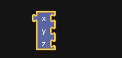

Now we have a list we only need to get some values. Under the math library look for the first block that
contains a value of 0, this is a number block, it returns the value that the user types on it, or the variable that's connected to it.
Go ahead and grab three number blocks for each of the xyz inputs. Try different numbers, formulas or variables out,
remember to turn on the AUTO in order to see the changes as you type.

.. raw:: html

    <iframe width="560" height="315" src="https://www.youtube.com/embed/4T0fzvv9g5E" frameborder="0" allowfullscreen></iframe>

.. _sphere:

Using the sphere block
=============================

The sphere block can be found under the CAD/Parts library.

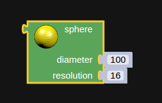

      the default sphere block.

The sphere has two parameters:
      * Diameter, a numeric value and defines the size of the sphere
      * Resolution, a numeric value that defines the number of poligons that make the shape

.. raw:: html

    <iframe width="560" height="315" src="https://www.youtube.com/embed/eMlpUuBv_ZI" frameborder="0" allowfullscreen></iframe>

.. _cylinder:

Using the cylinder block
=============================

The cylinder block can be found under the CAD/Parts library.

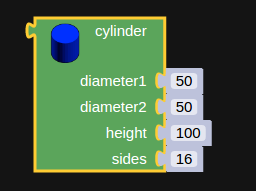

      the default cylinder block.

This block has four parameters:

      * Diameter1, a numeric value that defines the size of the lower base.
      * Diameter2, a numeric value that defines the size of the upper base.
      * Height, a numeric value that defines how tall is the cylinder.
      * Sides, a numeric value that defines how many sides our prism will have.

.. raw:: html

    <iframe width="560" height="315" src="https://www.youtube.com/embed/-xV4dONH3Dg" frameborder="0" allowfullscreen></iframe>

.. _torus:

Using the torus block
=============================

A torus is a Donut shaped mesh, defined as a revolving circle in an axis coplanar with the circle.

The torus is found in the CAD/Parts library.

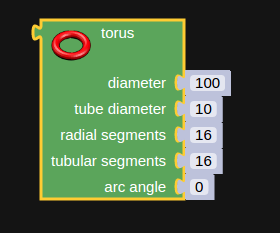

      the default torus block.

The torus has five parameters:

    * diameter, a numeric value that defines the torus radius.
    * tube diameter, a numeric value that defines how thick is the ring.
    * radial segments, a numeric value that defines how many "sides" the section of the torus will have.
    * tubular segments, a numeric value that defines the how many "sides" the torus itself will have.
    * arc angle, a numeric value that defines if we only what a partial part of the torus.

.. raw:: html

    <iframe width="560" height="315" src="https://www.youtube.com/embed/px-Q_1qOajM" frameborder="0" allowfullscreen></iframe>

.. _polygon:

Using the polygon block
=============================

The polygon block defines a 2D shape, this shape is given by a list of  at least three points or vertices.
This given list of vertices creates a face in the x,y plane.

Go ahead and get the polygon block from the CAD/Parts library and plug it to your main function, by default it returns a
triangle rectangle.

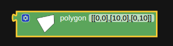

      the polygon block with default vertex list.

To make things easer we have included the OpenSCAD-polygon-editor that allows you to draw from scratch or trace a shape from
an image, click on the gear in the top left corner of the polygon editor.

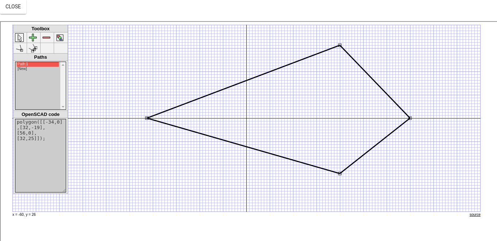

      the polygon editor interface.

From the selector menu (cursor icon) you can turn any point to a Bezier curve handle, or vertex.

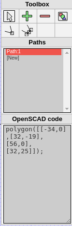

      the polygon selector menu.

We can add new vertices by clicking on the + icon next to the selector menu.

We delete vertices by clicking on the - icon next to the + icon.

Finally we can add an image to trace, by setting the URL, uploading it and then scaling it..

Once we are done setting up the points for our shape click close and they will be automatically added to the polygon block.

.. note:: Polygons require to be extruded to be displayed on the 3D view

   In order to see the polygon we just defined its important to add an extrusion block or else it wont be displayed.

.. raw:: html

    <iframe width="560" height="315" src="https://www.youtube.com/embed/kN7SnThxCyE" frameborder="0" allowfullscreen></iframe>

.. _text3D:

Using the text3D block
=============================

The 3Dtext block can be found under the CAD/Parts library.

It allows us to create a text based model, this block has the following main parameters:

  * text : a string value with the characters we are going to draw.
  * size: a numeric value that determines the thickness of the characters.
  * height:  a numeric value that determines the extrusion amount of the characters.

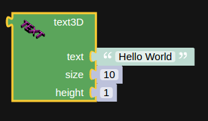

      the text3D block.

.. raw:: html

    <iframe width="560" height="315" src="https://www.youtube.com/embed/gwjbRAR8mhg" frameborder="0" allowfullscreen></iframe>

.. _part:

Using the part block
=============================

It's nice to be able to return different basic shapes, but most objects in real world are a mix
of different shapes that create a more complex shape. Thats the what the Part  block is for! this one is found under the
CAD/tools library it allows us to make some CSG (Constructive Solid Geometry) modeling operations, that work great for 3D printing.

.. figure:: ../_static/images/CAD/part.png

      using the part block

The part block has three options:

* Union, adds two parts together.

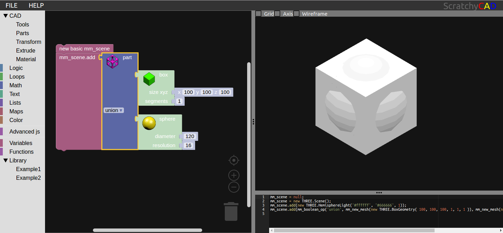

      union of a cube with a sphere

* Difference, subtracts the second part from the first part, it's order sensitive.

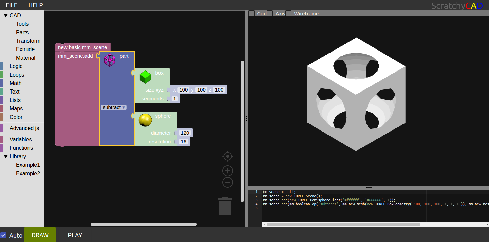

      difference of a cube with a sphere

* Intersection, returns only the overlap of both shapes.

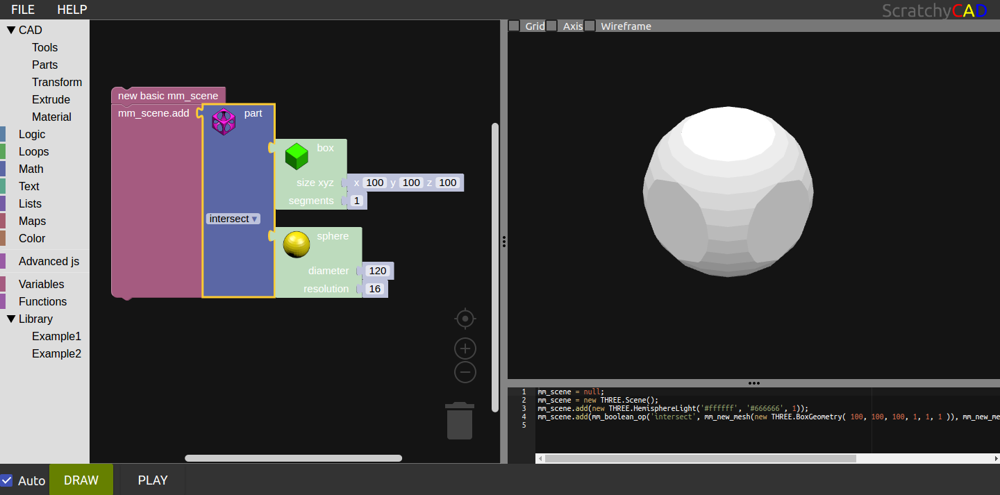

      intersection of a cube with a sphere

.. raw:: html

    <iframe width="560" height="315" src="https://www.youtube.com/embed/RWke0fLcbCo" frameborder="0" allowfullscreen></iframe>
