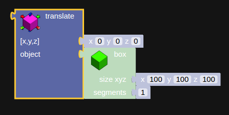

.. _transform:

***************
Transforms
***************

.. translate_:

Translate
=============================

Translating an object is the same as moving it, plug in an object and set the amount of units you want to move that object to position it where you need it.
The translation block can be found under the CAD/Transform menu.

      the translation block

.. note:: The translation is relative to the object's local coordinates.

.. raw:: html

    <iframe width="560" height="315" src="https://www.youtube.com/embed/IIu5nfVhfuM" frameborder="0" allowfullscreen></iframe>

.. scale_:

Scale
=============================

.. raw:: html

    <iframe width="560" height="315" src="https://www.youtube.com/embed/IIu5nfVhfuM" frameborder="0" allowfullscreen></iframe>

.. rotate_:

Rotate
=============================

.. raw:: html

    <iframe width="560" height="315" src="https://www.youtube.com/embed/ydDnXxXfGMg" frameborder="0" allowfullscreen></iframe>

.. setColor_:

Set color
=============================

.. raw:: html

    <iframe width="560" height="315" src="https://www.youtube.com/embed/Pe1IBeBIpGE" frameborder="0" allowfullscreen></iframe>

.. setColor_:

Set texture
=============================

.. raw:: html

    <iframe width="560" height="315" src="https://www.youtube.com/embed/mMdKvZqOPOw" frameborder="0" allowfullscreen></iframe>

.. extrude_:

Extrude
=============================

.. raw:: html

    <iframe width="560" height="315" src="https://www.youtube.com/embed/32iUdijAkVo" frameborder="0" allowfullscreen></iframe>

.. lathe:

Lathe
=============================

.. raw:: html

    <iframe width="560" height="315" src="https://www.youtube.com/embed/b6YKpPmapZA" frameborder="0" allowfullscreen></iframe>

.. lathe:

Path
=============================

.. raw:: html

    <iframe width="560" height="315" src="https://www.youtube.com/embed/rq0hnwGfvm8" frameborder="0" allowfullscreen></iframe>

Clone
=============================
